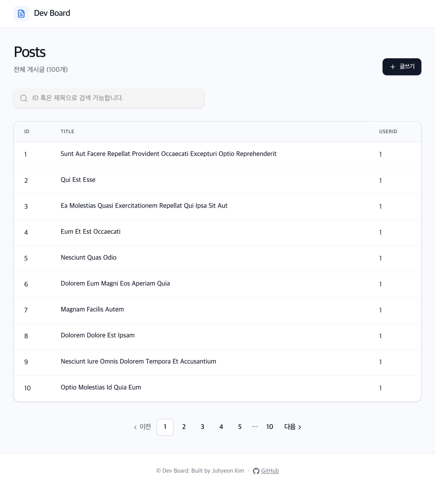
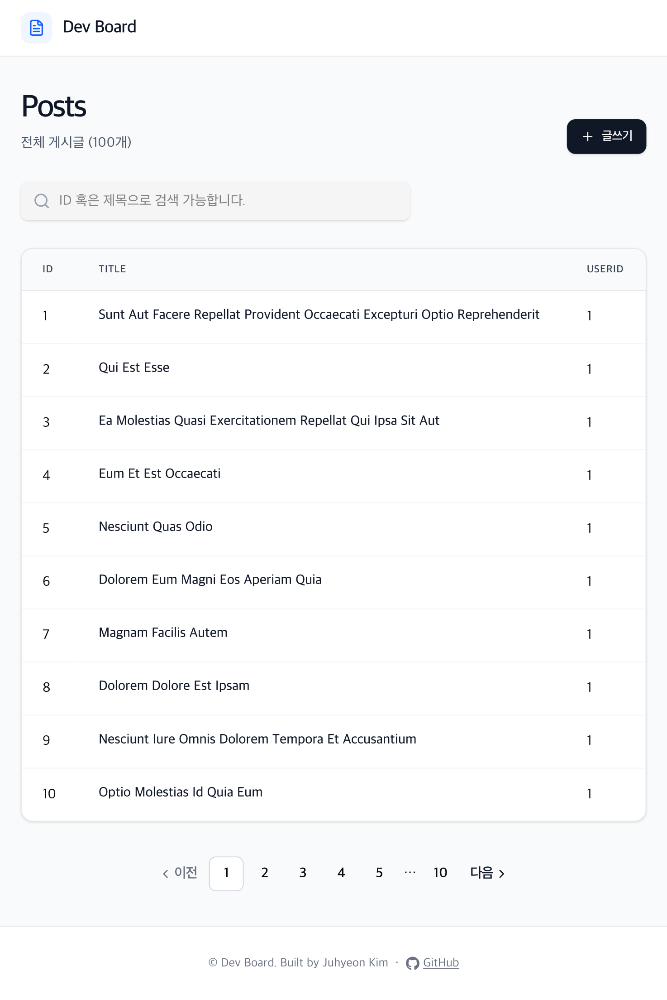
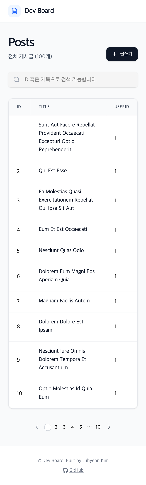

# Dev Board

Next.js + TypeScript로 구현한 게시판 웹 애플리케이션

Laptop


Tablet


Mobile


<br>

## 목차

1. [프로젝트 소개](#프로젝트-소개)
2. [기술 스택](#기술-스택)
3. [주요 기능](#주요-기능)
4. [프로젝트 구조](#프로젝트-구조)
5. [로컬 실행 방법](#로컬-실행-방법)
6. [화면 구성](#화면-구성)
7. [주요 구현 포인트](#주요-구현-포인트)
8. [구현하며 배운 점](#구현하며-배운-점)
9. [향후 개선 계획](#향후-개선-계획)
10. [제작자](#제작자)

<br>
<br>

## 프로젝트 소개

`React` 기반의 `Next.js` 프레임워크와 `TypeScript`를 활용해 제작한 **게시판** 서비스입니다.

게시글 **CRUD** 및 **댓글** 기능을 구현하였으며, `Vercel`을 통해 배포했습니다.

- **개발기간**: 7일
- **배포 주소**: <a href="https://nextjs-typescript-board-ashen.vercel.app/" target="_blank">https://nextjs-typescript-board-ashen.vercel.app/</a>

<br>
<br>

## 기술 스택

|      분류       | 기술                                                           |
| :-------------: | -------------------------------------------------------------- |
|  **Frontend**   | Next.js 16, React 19, TypeScript 5                             |
|     **UI**      | Tailwind CSS 4, shadcn/ui, Radix UI, lucide-react, react-icons |
| **데이터 통신** | Fetch API                                                      |
|    **알림**     | react-hot-toast                                                |
|  **외부 API**   | jsonplaceholder                                                |
|    **배포**     | Vercel                                                         |

<br>
<br>

## 주요 기능

### 게시글 (Posts)

- 목록 조회 - 전체 게시글 목록을 페이지네이션(10개씩)으로 제공
- 상세 조회 - 게시글 제목, 작성자, 본문 내용 확인
- 게시글 작성 / 수정 / 삭제
- 삭제 시 확인 모달 처리

### 댓글 (Comments)

- 게시글 상세 페이지에서 댓글 작성 (닉네임, 비밀번호, 내용 입력)
- 댓글 목록 조회 / 수정 / 삭제

<br>
<br>

## 프로젝트 구조

```
nextjs-typescript-board/
├── app/
│   ├── components/          # 공통 레이아웃 및 UI 컴포넌트 (Header, Footer 등)
│   ├── posts/
│   │   ├── [id]/
│   │   │   ├── components/  # 댓글 관련 컴포넌트
│   │   │   ├── edit/        # 게시글 수정 페이지
│   │   │   └── page.tsx     # 게시글 상세 페이지
│   │   ├── components/      # 게시글 목록 관련 컴포넌트
│   │   ├── new/             # 게시글 작성 페이지
│   │   └── page.tsx         # 게시글 목록 페이지
│   ├── layout.tsx
│   └── page.tsx
├── components/              # shadcn/ui 기반 공통 컴포넌트
├── lib/api/                 # API 호출 함수
├── utils/                   # 유틸리티 함수 (필터, 페이지네이션 등)
├── types/                   # TypeScript 타입 정의 (posts, comment)
└── public/                  # 정적 이미지 파일
```

<br>
<br>

## 로컬 실행 방법

```bash
# 레포지토리 클론
git clone https://github.com/pingandthepong/nextjs-typescript-board.git
cd nextjs-typescript-board

# 의존성 설치
npm install

# 개발 서버 실행
npm run dev
```

http://localhost:3000 접속

<br>
<br>

## 화면 구성

| 페이지      | 설명                                |
| ----------- | ----------------------------------- |
| 게시글 목록 | 전체 게시글을 페이지네이션으로 표시 |
| 게시글 상세 | 본문 내용 및 댓글 목록/작성         |
| 게시글 작성 | 제목 &middot; 내용 입력 폼          |
| 게시글 수정 | 기존 내용 불러와 편집               |

<br>
<br>

## 주요 구현 포인트

- App Router 기반 구조 설계
- Client / Server Component 분리
- 댓글 기능 직접 구현 (비로그인 인증 방식)
- 재사용 가능한 컴포넌트 설계

<br>
<br>

## 구현하며 배운 점

- Next.js의 **파일 기반 라우팅 구조** 이해
- **TypeScript** 타입 정의를 통한 컴포넌트 간 데이터 흐름 관리
- 동적 라우팅(`[id]`)을 활용한 게시글 상세 및 수정 페이지 구현
- **Vercel**을 통한 배포 프로세스 경험

<br>
<br>

## 향후 개선 계획

- 로그인 / 회원가입 기능 추가
- 좋아요 기능
- 이미지 업로드

<br>
<br>

## 제작자

**Juhyeon Kim**  
GitHub: [@pingandthepong](https://github.com/pingandthepong)
